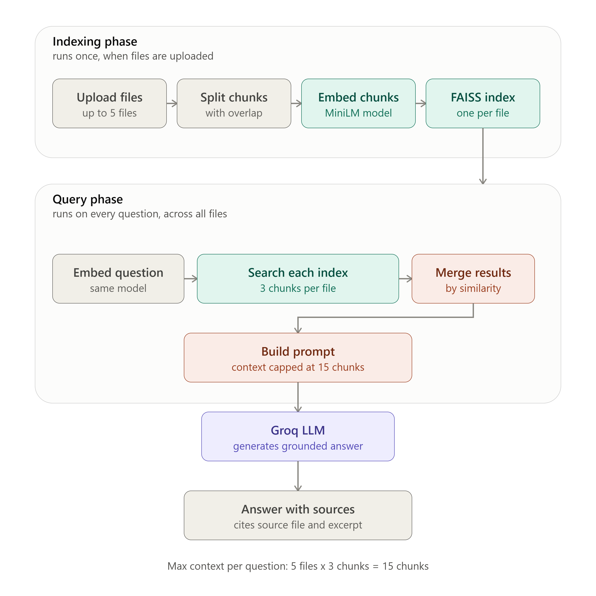

# DocChat - AI Document Q&A Assistant

DocChat is a Streamlit app for asking questions across up to five uploaded PDF, TXT,
or Markdown documents. Answers are generated from retrieved document excerpts, and
each response includes expandable source excerpts with filenames and PDF page numbers
when available.

The app uses local HuggingFace embeddings and FAISS for retrieval. Groq is used only
to generate the final answer from the retrieved context.

## Features

- Upload and index up to 5 documents per session.
- Parse `.pdf`, `.txt`, and `.md` files.
- Build a separate FAISS index for each source document.
- Retrieve up to 3 excerpts from every active document for each question.
- Keep the total retrieval bounded at 15 excerpts in the maximum-size session.
- Show source excerpts for every generated answer.
- Use a Groq API key from Streamlit secrets, an environment variable, or a
  password-masked sidebar field.
- Explain the retrieval and cost decisions in the in-app Architecture page.

## How it works

1. Uploaded files are written to temporary files and loaded with LangChain document
  loaders. Each document is tagged with its original filename.
2. Text is split with a recursive character splitter using a 1,000-character chunk
  size and 250-character overlap.
3. Chunks are embedded locally with `all-MiniLM-L6-v2` and grouped into one FAISS
  index per source file.
4. Each question is searched independently against every file's index. The results
  are merged by FAISS distance, with closer matches ranked first.
5. The retrieved excerpts and question are sent to Groq's
  `openai/gpt-oss-120b` model at temperature `0.1`. The prompt instructs the model
  to use only the supplied context and to say when the documents do not contain an
  answer.

This per-file retrieval strategy gives every uploaded document a guaranteed place in
the context. It avoids a single shared top-k search being dominated by similarly worded
sections from only one or two files.

## Architecture

The diagram below shows the indexing phase and the per-question retrieval and generation
flow, including the maximum context of 15 chunks for a five-file session.

<p align="center">
  
</p>

## Project structure

```text
ai-doc-qa-assistant/
├── app.py                         # Streamlit entrypoint and top-level navigation
├── app_pages/
│   ├── chat.py                    # Upload, indexing, chat, and source display UI
│   └── architecture.py            # Active Architecture page and system diagram
├── pages/
│   └── 1_Architecture.py          # Legacy page not used by app.py navigation
├── rag_pipeline.py                # Loading, chunking, embedding, retrieval, and LLM calls
├── styles.py                      # Shared dark-theme CSS
├── requirements.txt               # Python dependencies
├── runtime.txt                    # Python 3.11 deployment runtime
├── .streamlit/config.toml         # Streamlit theme and server settings
├── DEPLOYMENTS.md                 # Streamlit Community Cloud deployment guide
├── docchat_architecture_detailed.png # Architecture reference image
└── README.md
```

`app.py` currently registers Chat and Architecture with Streamlit's top-positioned
navigation. The active Architecture page is `app_pages/architecture.py`, which renders
the pipeline explanation and `docchat_architecture_detailed.png`. The
`pages/1_Architecture.py` file is a legacy duplicate and is not selected by the current
navigation setup.

## Run locally

### Prerequisites

- Python 3.11
- A free Groq API key from [console.groq.com](https://console.groq.com)

Create and activate a virtual environment, then install the pinned dependencies:

```powershell
python -m venv venv
.\venv\Scripts\Activate.ps1
pip install -r requirements.txt
```

On macOS or Linux, activate the environment with:

```bash
source venv/bin/activate
```

Set the key before starting Streamlit:

```powershell
$env:GROQ_API_KEY = "your_groq_api_key"
streamlit run app.py
```

Alternatively, create a local `.env` file containing:

```dotenv
GROQ_API_KEY=your_groq_api_key
```

The app loads this file with `python-dotenv`. There is no committed `.env.example` in
this repository, so do not copy one from the README; create `.env` manually or enter
the key in the sidebar when the app is running. The local `.env` file is ignored by
Git.

Open the URL printed by Streamlit, normally
`http://localhost:8501`. Upload documents in the sidebar, select **Process documents**,
and then ask questions in the chat input.

## Deploy on Streamlit Community Cloud

See [DEPLOYMENTS.md](DEPLOYMENTS.md) for the complete deployment walkthrough. The
short version is:

1. Push the repository to GitHub without `.env` or `.streamlit/secrets.toml`.
2. Create a Streamlit Community Cloud app with `app.py` as the main file.
3. Add this secret in the app's Advanced settings or Secrets panel:

  ```toml
  GROQ_API_KEY = "your_real_groq_api_key_here"
  ```

4. Deploy. The repository's `runtime.txt` pins Python to 3.11, which avoids dependency
  build failures on platforms that select a newer Python version by default.

## Security and data handling

- API keys are read from Streamlit secrets first, then `GROQ_API_KEY`, then the
  password-masked sidebar input.
- Keys are not displayed, logged, or written by the app.
- Uploaded files are written to temporary paths only while they are being parsed; the
  temporary files are deleted afterward.
- Embeddings and FAISS indexes live in the current Streamlit session's memory.
- Retrieved excerpts and the question are sent to Groq for answer generation.
- Processing a new batch replaces the current indexes and chat history. **Clear
  session** removes the active indexes, model, document list, and chat history.

## Limitations

- Maximum of 5 uploaded files per session.
- PDFs must contain extractable text; scanned or image-only PDFs are not OCR'd.
- The embedding model is downloaded on first use and cached for the process.
- The Groq free tier has rate limits and may require waiting between requests.
- Chat history and indexes are session-local and are not persisted between sessions.
